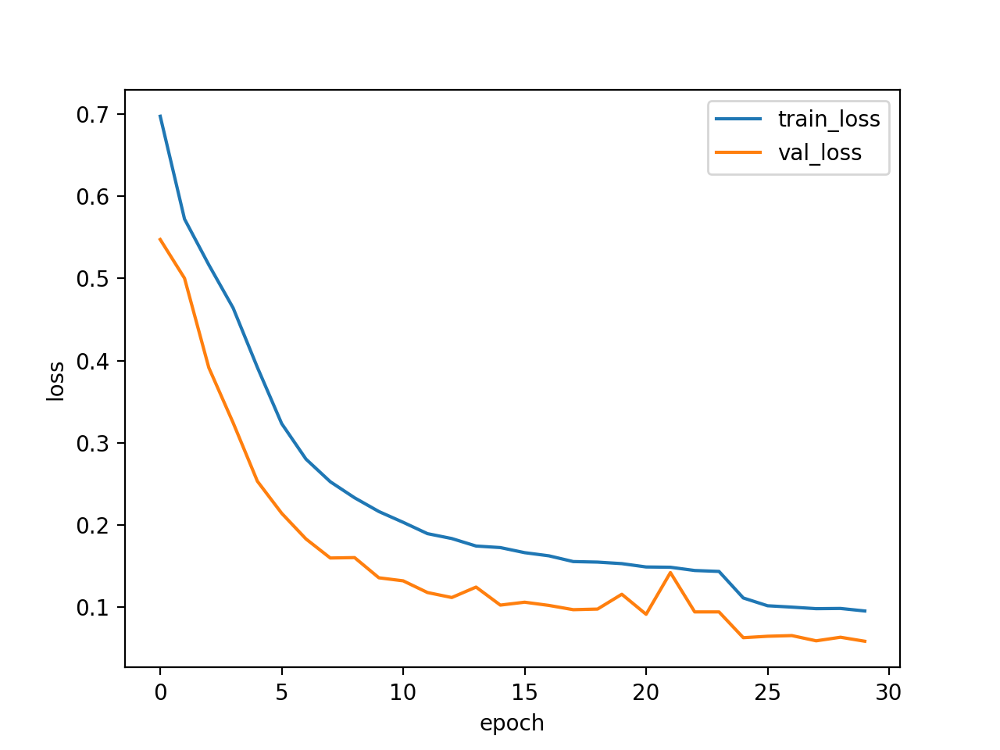
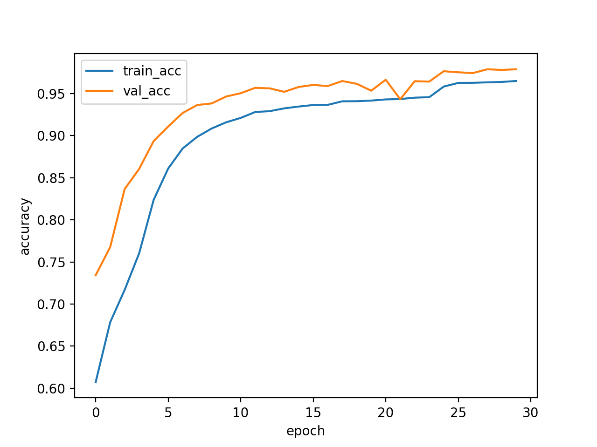
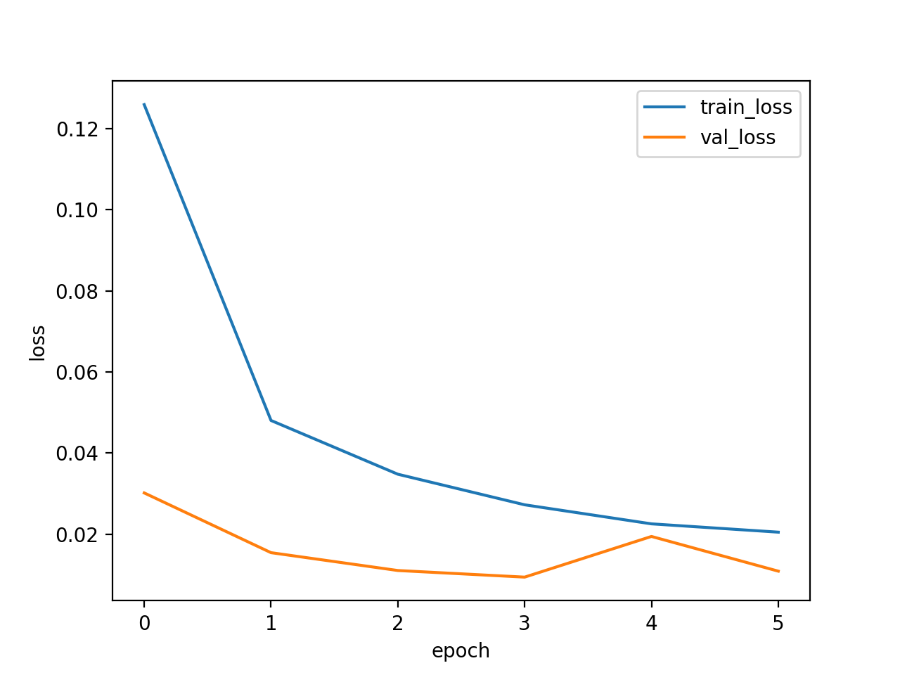
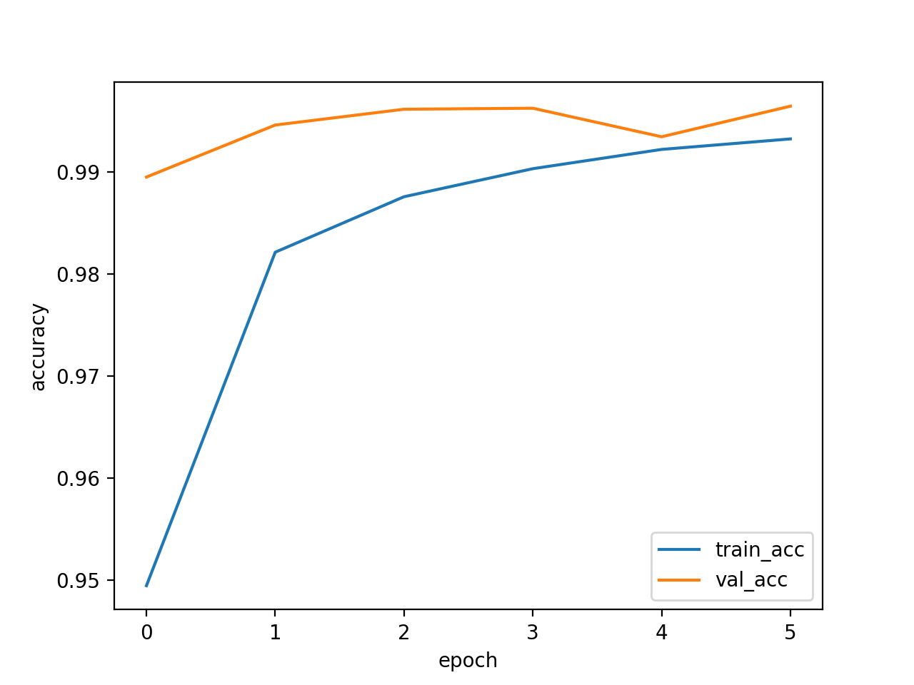

## Real vs Fake Face Classification

This project focuses on binary classification of facial images as **Real** or **Fake**
using deep learning techniques.

---

## Project Overview

The goal of this project is to evaluate different deep learning approaches for
detecting AI-generated (fake) face images. We compare a baseline CNN trained
from scratch with transfer learning and fine-tuning strategies based on ResNet50.

---

## Project Structure

### Source Code (`src/`)

- **train_simplecnn.py**  
  Baseline CNN trained from scratch and used as a reference model.

- **train_resnet50.py**  
  Transfer learning approach using a pre-trained ResNet50 model with frozen backbone.

- **train_resnet50_finetune.py**  
  Final and best-performing model. ResNet50 with fine-tuning applied to `layer4`
  and the classifier.

---

## Outputs (`results/`)

For each model, the following outputs are provided:
- Training and validation loss curves
- Training and validation accuracy curves
- Confusion matrix
- Test classification report

---

## Dataset

The dataset is a binary face image dataset consisting of two classes: **real** and **fake**.

The dataset root directory is specified using the `CFG.base_dir` variable inside
each training script.

Example configuration: CFG.base_dir = "/path/to/dataset"

Expected directory structure:
dataset/
├── train/
│ ├── real/
│ └── fake/
├── val/
│ ├── real/
│ └── fake/
└── test/
├── real/
└── fake/

---

## Installation

Install required dependencies using: pip install -r requirements.txt

---

## How to Run

Run the training scripts in the following order:
python train_simplecnn.py
python train_resnet50.py
python train_resnet50_finetune.py

Make sure `CFG.base_dir` is set correctly before running the scripts.

---

## Results Summary

- **SimpleCNN:** ~98% test accuracy  
- **ResNet50 (Frozen):** ~91% test accuracy  
- **ResNet50 (Fine-tuned):** ~99.6% test accuracy (best model)

---

## Notes

- The dataset is not included in this repository due to size constraints.
- This project was developed as part of the **CENG 476 – Introduction to Deep Learning** course.

## Training Curves and Evaluation Results

### SimpleCNN

---

### ResNet50 (Fine-tuned)

---

## Inference Demo (External Images)

Below are example predictions on external images that were not part of the training dataset.

### Fake Image Example

- **SimpleCNN:** Fake (83.67%)
- **ResNet50:** Fake (84.85%)

---

### Real Image Example

- **SimpleCNN:** Real (99.99%)
- **ResNet50:** Real (100.00%)
